# HM Snacks Workflow System
## Complete Technical Guide & Presentation Manual

---

# Table of Contents

1. [System Overview](#system-overview)
2. [Admin Workflow](#admin-workflow)
3. [Order Processing Workflow](#order-processing-workflow)
4. [Shipping Workflow](#shipping-workflow)
5. [Affiliate Program Workflow](#affiliate-program-workflow)
6. [Vendor Management Workflow](#vendor-management-workflow)
7. [System Integration Map](#system-integration-map)

---

# System Overview

## What is HM Snacks?

HM Snacks is a comprehensive **multi-vendor e-commerce platform** specializing in snack products with integrated:
- **Order Management System**
- **Multi-tier Affiliate Marketing Program (MLM)**
- **Shiprocket Logistics Integration**
- **Vendor Profit-Sharing System**
- **Razorpay Payment Gateway**

## Key Technologies

| Component | Technology |
|-----------|-----------|
| Framework | Next.js (React) |
| Database | PostgreSQL + Drizzle ORM |
| Payment | Razorpay |
| Shipping | Shiprocket API |
| Authentication | Custom authentication |
| UI | Framer Motion + Tailwind CSS |

## Database Architecture

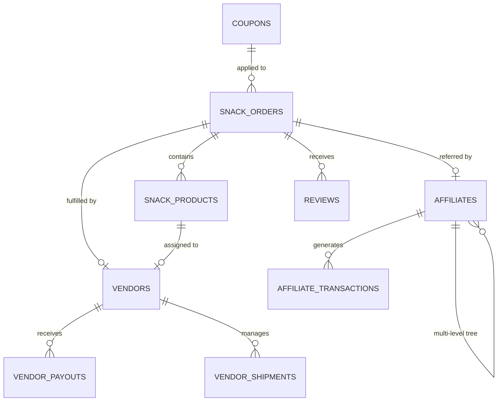

---

# Admin Workflow

## Overview

The admin dashboard is the **central control panel** for managing all aspects of the HM Snacks platform. Admin users have comprehensive access to:

- Product catalog management
- Order processing and fulfillment
- Vendor onboarding and settlements
- Affiliate program oversight
- Financial reporting and analytics
- Customer service tools

## Admin Access & Permissions

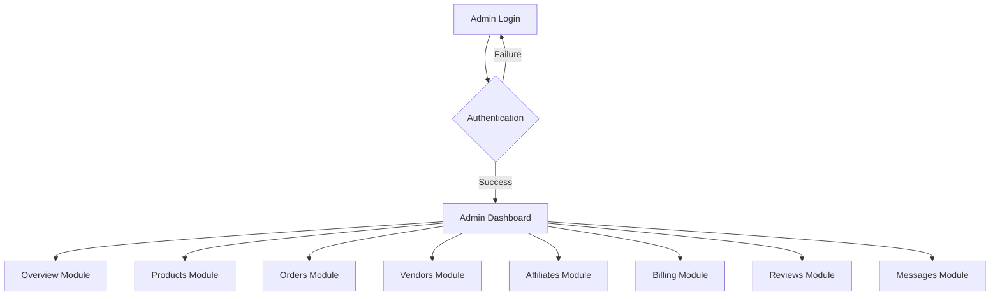

## Core Admin Modules

### 1. Overview Module

**Purpose**: Provides real-time analytics and key performance indicators

**Key Metrics**:
- Total Orders
- Revenue (Today, This Week, This Month, All-Time)
- Active Affiliates
- Pending Settlements
- Low Stock Alerts

### 2. Products Module

**Purpose**: Complete product catalog management

**Features**:
- Product creation with pricing (MRP, Selling Price, Cost Price)
- Vendor assignment
- Image upload and management
- Inventory tracking
- Dimension specifications for shipping calculations

**Product Data Structure**:
```typescript
{
  id: string,
  name: string,
  category: string,
  price: number,           // Selling Price
  mrp: number,             // Maximum Retail Price
  costPrice: number,       // Vendor cost
  vendorId: string,
  stock: number,
  weight: number,          // in kg
  dimensions: {length, breadth, height}  // in cm
}
```

### 3. Orders Module

**Purpose**: End-to-end order lifecycle management

#### Order Processing States
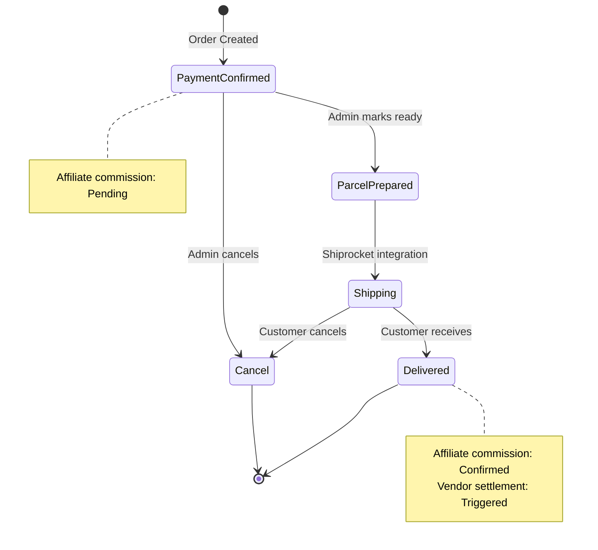

**Order Statuses**:
- **Payment Confirmed**: Initial state after payment
- **Parcel Prepared**: Vendor has packaged the order
- **Shipping**: In transit via Shiprocket
- **Delivered**: Successfully delivered
- **Cancel**: Order cancelled

**Advanced Features**:
- Manual order creation
- WhatsApp notifications
- CSV export
- Shipment tracking
- Dimension updates

### 4. Vendors Module

**Purpose**: Multi-vendor partner management

**Features**:
- Vendor onboarding
- Pickup location assignment
- Bank details management
- Earnings tracking (total, paid, pending)
- Payout processing

### 5. Affiliates Module

**Purpose**: MLM network management

**Features**:
- Affiliate registration approval
- Binary tree visualization
- Commission tracking
- Tier management
- Payout processing

---

# Order Processing Workflow

## Complete Order Lifecycle

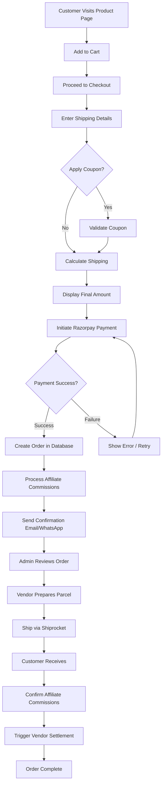

## Step-by-Step Process

### Step 1: Customer Order Placement

**Actions**:
1. Customer adds products to cart
2. Enters shipping details (Name, Mobile, Address, Pincode)
3. System calculates shipping cost based on:
   - Delivery pincode
   - Product dimensions and weight
   - COD vs Prepaid

### Step 2: Coupon Application

**Coupon Validation**:
- Check if coupon exists and is active
- Verify usage limits
- Calculate discount (percentage or fixed amount)

### Step 3: Payment Processing

**Razorpay Integration**:
```typescript
// Create Razorpay Order
const order = await razorpay.orders.create({
  amount: finalAmount * 100, // Convert to paise
  currency: "INR",
  receipt: `receipt_${Date.now()}`,
});

// Verify Payment Signature
const signature = crypto
  .createHmac('sha256', RAZORPAY_KEY_SECRET)
  .update(`${order_id}|${payment_id}`)
  .digest('hex');
```

### Step 4: Order Creation

**Database Entry**:
```typescript
await db.insert(snackOrders).values({
  orderId: `HM${uniqueNumber}`,
  customerName,
  items: JSON.stringify(cartItems),
  totalAmount,
  status: 'Payment Confirmed',
  affiliateId: referralCode ? affiliateId : null,
  paymentId: razorpay_payment_id,
});
```

### Step 5: Affiliate Commission Processing

**Commission Distribution**:
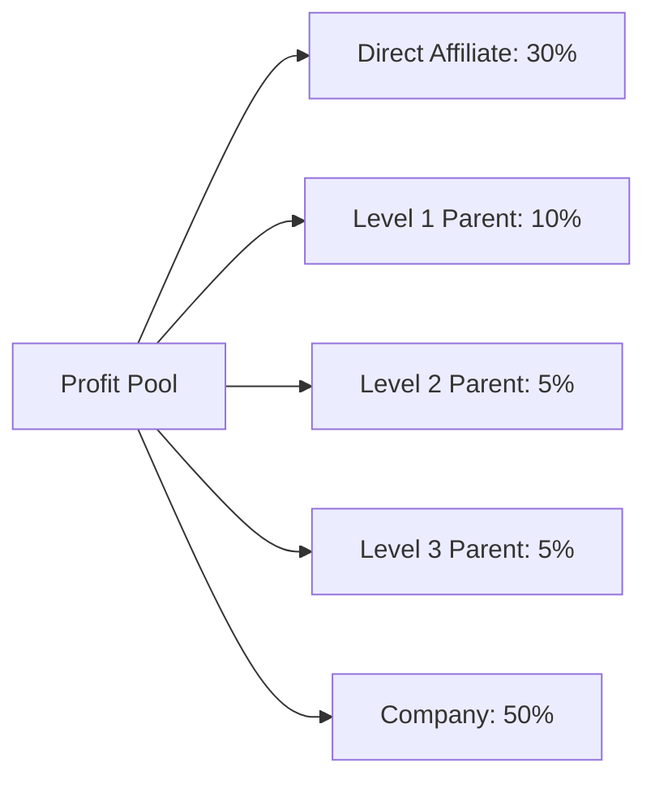

**Process**:
1. Calculate profit: `Selling Price - Cost Price - Shipping`
2. Determine profit pool (50% of profit)
3. Distribute to direct affiliate and up to 3 parent levels
4. Store in `affiliate_transactions` with status "Pending"

### Step 6: Order Fulfillment

**Admin/Vendor Actions**:
1. Review order
2. Prepare package
3. Update status to "Parcel Prepared"

### Step 7: Shipping Integration

See [Shipping Workflow](#shipping-workflow) section.

### Step 8: Delivery Confirmation

**When Status → "Delivered"**:
1. Move affiliate commissions from pending to available balance
2. Update vendor earnings
3. Send delivery confirmation

## Order Status Transitions

| From Status | To Status | Trigger | System Actions |
|-------------|-----------|---------|----------------|
| - | Payment Confirmed | Razorpay success | Process affiliate commissions (pending) |
| Payment Confirmed | Parcel Prepared | Admin/Vendor action | Notify customer |
| Parcel Prepared | Shipping | Shiprocket booking | Generate AWB, tracking URL |
| Shipping | Delivered | Delivery | Confirm commissions, settle vendor |
| Any | Cancel | Admin/Customer | Reverse commissions, refund |

---

# Shipping Workflow

## Shiprocket Integration Architecture

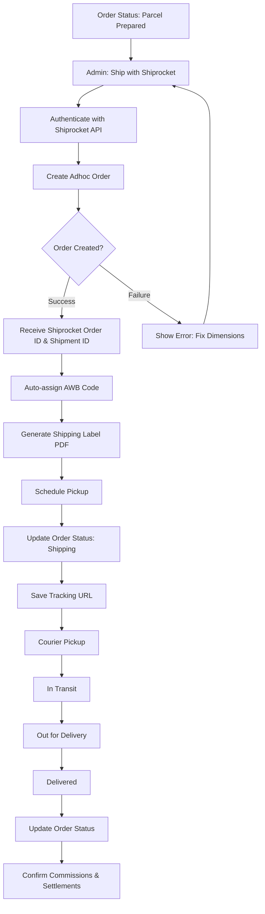

## Shiprocket API Functions

### 1. Authentication

```typescript
POST https://apiv2.shiprocket.in/v1/external/auth/login
Body: { email, password }
Response: { token }
```

### 2. Create Order

**Request**:
```typescript
{
  "order_id": "HM12345",
  "pickup_location": "Primary Warehouse",
  "billing_customer_name": "John Doe",
  "billing_phone": "9876543210",
  "billing_address": "123 Street",
  "billing_pincode": "400001",
  "order_items": [...],
  "payment_method": "Prepaid",
  "length": 10,
  "breadth": 10,
  "height": 5,
  "weight": 0.5
}
```

**Response**:
```typescript
{
  "order_id": 123456789,
  "shipment_id": 987654321,
  "awb_code": "AWB123456789",
  "courier_name": "Delhivery"
}
```

### 3. Generate Label

```typescript
POST /courier/generate/label
Body: { "shipment_id": [987654321] }
Response: { "label_url": "https://..." }
```

### 4. Schedule Pickup

```typescript
POST /courier/generate/pickup
Body: { "shipment_id": [987654321] }
```

## Shipping Cost Calculation

**Factors**:
1. Distance (pickup → delivery pincode)
2. Weight (actual weight in kg)
3. Volumetric Weight = (L × B × H) / 5000
4. Payment Method (COD attracts ₹50 extra)

**Example**:
```
Product: Chips (20cm × 15cm × 10cm, 0.5kg)
Delivery: Mumbai → Delhi

Actual Weight: 0.5 kg
Volumetric Weight: (20 × 15 × 10) / 5000 = 0.6 kg
Chargeable Weight: max(0.5, 0.6) = 0.6 kg

Base Rate: ₹40
Weight Surcharge: ₹2
COD Charges: ₹50
Total: ₹92
```

---

# Affiliate Program Workflow

## Multi-Level Marketing (MLM) System

HM Snacks implements a **Binary Tree MLM** with **tiered commissions** and **profit-sharing**.

## MLM Structure

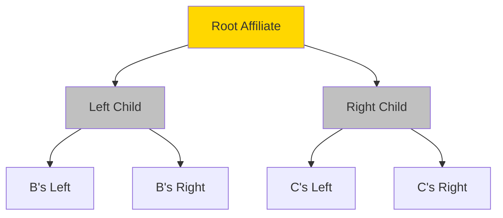

## Affiliate Registration Process

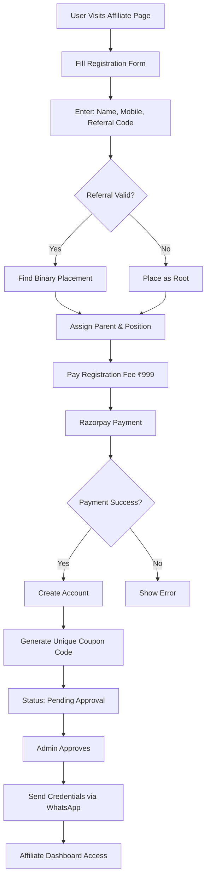

## Binary Placement Algorithm

**BFS Algorithm** to find first available position:
```typescript
function findBinaryPlacement(referrerId) {
  let queue = [referrerId];
  while (queue.length > 0) {
    const currentId = queue.shift();
    const children = getChildren(currentId);
    
    if (!hasLeft) return {parentId: currentId, position: 'left'};
    if (!hasRight) return {parentId: currentId, position: 'right'};
    
    queue.push(leftChild.id, rightChild.id);
  }
}
```

## Affiliate Tier System

| Tier | Min Orders | Max Orders | Commission Rate |
|------|-----------|-----------|-----------------|
| **Newbie** | 0 | 20 | 30% |
| **Starter** | 21 | 50 | 35% |
| **Silver** | 51 | 100 | 40% |
| **Golden** | 101 | 150 | 45% |
| **Platinum** | 151 | 180 | 50% |
| **Pro** | 181 | 200 | 55% |
| **Elite** | 201+ | ∞ | 60% |

**Note**: Tier requires `isPaid = true`

## Commission Distribution

### Profit Pool Calculation

```
Profit = Selling Price - Cost Price - Shipping Cost
Profit Pool = Profit × 50%
```

**Example**:
```
Selling Price: ₹100
Cost Price: ₹40
Shipping: ₹50
Profit: ₹10
Profit Pool: ₹5
```

### Multi-Level Split

| Level | Recipient | Split | Amount (₹5 example) |
|-------|-----------|-------|---------------------|
| Direct | Referring affiliate | 30% | ₹1.50 |
| Level 1 | Direct's parent | 10% | ₹0.50 |
| Level 2 | Level 1's parent | 5% | ₹0.25 |
| Level 3 | Level 2's parent | 5% | ₹0.25 |
| Company | Retained | 50% | ₹2.50 |

### Commission States

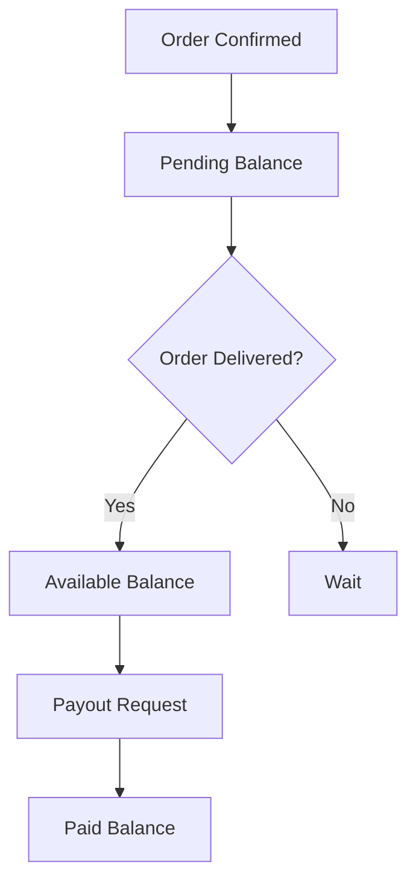

**1. Pending Balance**: Reserved until delivery
**2. Available Balance**: Withdrawable funds
**3. Paid Balance**: Historical payouts

## Affiliate Dashboard

**Features**:
1. **Profile**: Name, tier badge, coupon code
2. **Earnings**: Pending, available, paid balances
3. **Metrics**: Total orders, conversion rate, tier progress
4. **Tree Visualization**: Interactive binary tree
5. **Transactions**: Commission history
6. **Referral Tools**: Share links, WhatsApp templates
7. **Payout Requests**: Minimum ₹500

---

# Vendor Management Workflow

## Multi-Vendor Architecture

**Vendors**:
- Supply and fulfill products
- Manage inventory
- Share profits via cost price agreements
- Handle order preparation

## Vendor Onboarding

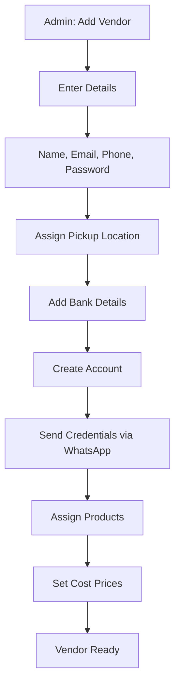

## Vendor Data Structure

```typescript
{
  id: string,
  name: string,
  email: string,
  phone: string,
  pickupLocationId: string,  // Shiprocket warehouse
  totalEarnings: number,
  paidAmount: number,
  pendingBalance: number,
  bankDetails: {
    accountNumber, ifsc, bankName, upiId
  }
}
```

## Product Assignment

**Flow**:
1. Admin creates product
2. Assigns vendorId
3. Sets costPrice (vendor's cost)
4. Associates with vendor's pickup location

**Example**:
```
Product: Potato Chips
Vendor: ABC Snacks
Cost Price: ₹40
Selling Price: ₹100

Per Unit:
- Vendor Earnings: ₹40
- Shipping: ₹50
- Affiliate Commission: ₹5
- Company Profit: ₹5
```

## Vendor Fulfillment Workflow

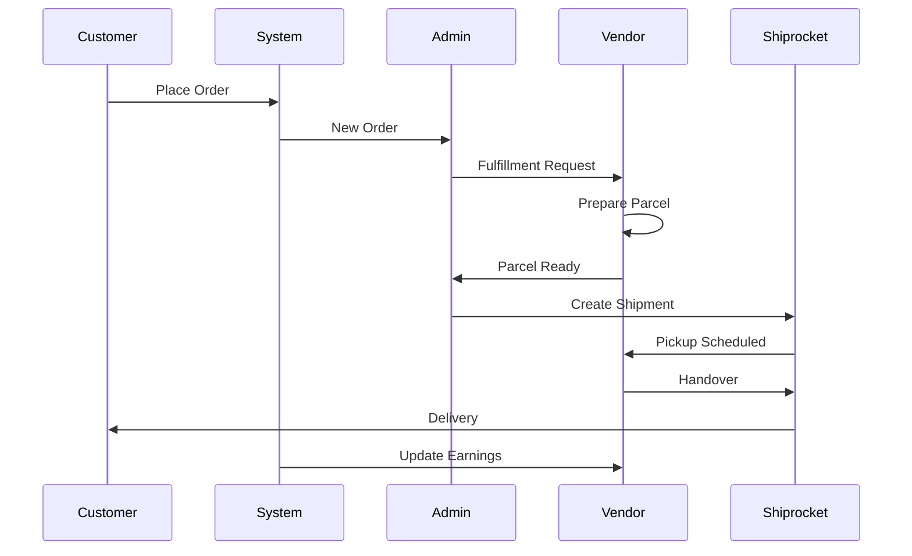

## Earnings Calculation

**Trigger**: Order Status = "Delivered"

```typescript
function calculateVendorEarnings(order) {
  let earnings = 0;
  for (const item of order.items) {
    const product = getProduct(item.productId);
    if (product.vendorId === vendor.id) {
      earnings += product.costPrice * item.quantity;
    }
  }
  return earnings;
}
```

## Settlement Process

### 1. View Pending Settlements
```
Vendor: ABC Snacks
Pending: ₹15,000
Total Earnings: ₹85,000
Paid: ₹70,000
```

### 2. Record Payout
- Amount (auto-filled)
- Payment method (UPI/NEFT/RTGS)
- Payment ID
- Notes

### 3. Database Update
```typescript
// Create payout record
await db.insert(vendorPayouts).values({
  vendorId, amount, paymentId, method: 'UPI'
});

// Update balances
await db.update(vendors).set({
  paidAmount: paidAmount + amount,
  pendingBalance: pendingBalance - amount
});
```

---

# System Integration Map

## Complete Architecture

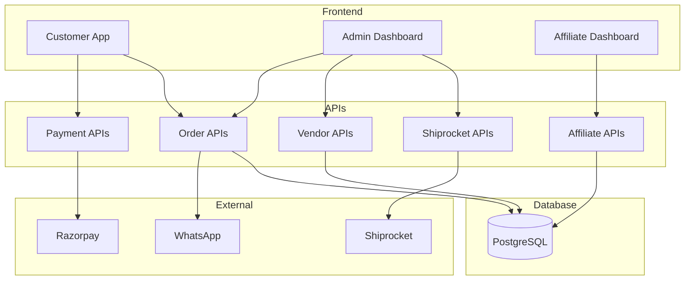

## Data Flow

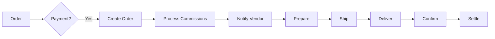

## Technology Stack

- **Frontend**: Next.js, React, Tailwind CSS, Framer Motion
- **Backend**: Next.js API Routes
- **Database**: PostgreSQL + Drizzle ORM
- **Payment**: Razorpay SDK
- **Shipping**: Shiprocket REST API
- **Notifications**: WhatsApp Business API

---

# Appendix: Database Schema

## snack_orders
```sql
CREATE TABLE snack_orders (
  id TEXT PRIMARY KEY,
  order_id TEXT UNIQUE,
  customer_name TEXT,
  items JSONB,
  total_amount REAL,
  status TEXT,
  affiliate_id TEXT,
  vendor_id TEXT,
  shiprocket_order_id TEXT,
  awb_code TEXT,
  created_at TIMESTAMP
);
```

## affiliates
```sql
CREATE TABLE affiliates (
  id TEXT PRIMARY KEY,
  full_name TEXT,
  mobile TEXT UNIQUE,
  coupon_code TEXT UNIQUE,
  parent_id TEXT,
  position TEXT,  -- 'left' or 'right'
  is_paid BOOLEAN,
  pending_balance REAL,
  available_balance REAL,
  paid_balance REAL,
  total_orders INTEGER,
  current_tier TEXT
);
```

## vendors
```sql
CREATE TABLE vendors (
  id TEXT PRIMARY KEY,
  name TEXT,
  email TEXT UNIQUE,
  pickup_location_id TEXT,
  total_earnings REAL,
  paid_amount REAL,
  pending_balance REAL,
  bank_details JSONB
);
```

---

# Conclusion

This guide covers the complete HM Snacks workflow:

✅ **Admin Management**: Central control panel  
✅ **Order Processing**: End-to-end lifecycle  
✅ **Shipping Integration**: Shiprocket automation  
✅ **Affiliate Program**: Binary MLM with tiers  
✅ **Vendor Management**: Multi-vendor ecosystem  

**System Highlights**:
- Automated workflows
- Real-time tracking
- Scalable architecture
- Transparent earnings
- Integrated payments

---

**Document Version**: 1.0  
**Last Updated**: January 20, 2026  
**Prepared By**: HM Snacks Technical Team
